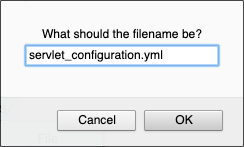

# Writing microservice for JLupin platform

JLupin Platform supports creating web application with use of servlet containers. For this Spring Boot is used. Application created this way is also a microservice but with exposed full http API.

For the purpose of this scenario and simplicity, there's already everything configured on the server, including required project's structure. Full description of the recommended structure is available [here](https://jlupin.io/documentation/continuous-delivery-maven-plugin-161/page/recommended_structure-overview.html).

## Creating and opening a new file in Katacoda

Let's make sure that you have a clear understanding of katacoda's own code editor, that should be available on your right and look exactly like on the screenshot below.

In order to create a new file, you have to use the tree editor and find file's location. If you have it, you can open the context menu using right mouse button and select "New file". In this case you're going to create a file named `servlet-properties.yml` in `/root/scenario/project/hello-jlupin/additional-files`.

A popup should appear asking you for the file name.

This operation could take a few seconds and force the tree view to refresh, thus collapsing all open folders. Now, open the file, it should be empty.

Find the code snippet of the file that you are currently creating and press the button in the upper right corner to copy file's content to the opened file.

Great! One of the files for the new microservice is already done, only couple more to go.

## Required microservice files

Create following files in proper locations that are described on top of every file.

### /root/scenario/project/hello-jlupin/additional-files/servlet_configuration.yml

This is the default servlet configuration without any changes to default values. Full description and meaning of each field is available [here](https://jlupin.io/documentation/jlupin-platform-161/page/architecture-microservice-servlet_configuration_yml.html)

<pre class="file" data-filename="/root/scenario/project/hello-jlupin/additional-files/servlet_configuration.yml" data-target="replace">
SERVERS:
  HTTP:
    type: spring_boot
    httpPrimaryPort: -1
    httpSecondaryPort: -1
    waitForFinishExecuteAllRequests: true
    waitToShutdownThreadsOnStop: 5000
    springBootLoaderClassName: org.springframework.boot.loader.WarLauncher
    contextName: /hello-jlupin
    isStartOnMainServerInitialize: true
    httpStickySession: false
    isLoadSimpleApplicationPropertiesBeforeStartup: true
  TRANSMISSION:
    readTimeout: 480000
    isWaitForFinishExecuteAllRequests: false
    waitToShutdownThreadsOnStop: 60000
    backlog: 0
    receiveBufferSize: 0
    isReuseAddress: false
    threadPoolSize: 2
    isLogPeriodicOnDebug: true
    isDestroyThreadOnTimeout: false
    threadExecutingTimeOut: 3600000
    isStartOnMainServerInitialize: true
ENTRY_POINTS:
  TRANSMISSION:
    SERIALIZER:
      producer: com.jlupin.impl.functional.supplier.serializer.JLupinJAVASerializerSupplierImpl
PROPERTIES:
  platformVersion: '1.6.1.0'
  #jvmOptions1: '-Xms128M -Xmx256M -Dlog4j.configurationFile=${sys:microservice.dir}/log4j2.xml -Dlogging.config=${microservice.dir}/log4j2.xml -agentlib:jdwp=transport=dt_socket,address=12998,server=y,suspend=n'
  jvmOptions1: '-Xms128M -Xmx256M -Dlog4j.configurationFile=${sys:microservice.dir}/log4j2.xml -Dlogging.config=${microservice.dir}/log4j2.xml' #jvmOptions_2 - default the same as jvmOptions_1
  #jvmOptions2: '-Xms128M -Xmx256M -Dlog4j.configurationFile=${sys:microservice.dir}/log4j2.xml -Dlogging.config=${microservice.dir}/log4j2.xml'
  externalPort: '8000'
  version: '1.0-SNAPSHOT'
  switchDelayTime: 0
  connectionSocketTimeoutInMillis: 1000
  readTimeoutInMillis: 30000
  isKeepAlive: false
  isOOBInline: false
  isTcpNoDelay: false
  isReuseAddress: false
  sendBufferSize: 0
  receiveBufferSize: 0
  soLinger: 0
  trafficClass: 0
  #javaExecutablePath: 'c:\\jvm\\bin\\java.exe'
  #additionalClassPath: 'c:\\temp\\*'
  isStartOnMainServerInitialize: true
  priorityStartOnMainServerInitialize: 4
  waitForProcessInitResponseTimeInMillis: 90000
  waitForProcessStartResponseTimeInMillis: 90000
  waitForProcessDestroyResponseTimeInMillis: 30000
  isArchiveOnStart: false
  startLogMode: INFO
  isInitErrorCauseWithNetworkInformation: true
  isJmxEnabled: true
  jmxOptions: '-Dcom.sun.management.jmxremote.local.only=false -Dcom.sun.management.jmxremote.authenticate=false -Dcom.sun.management.jmxremote.ssl=false'
  jmxPrimaryPort: -1
  jmxSecondaryPort: -1
  isExternalHealthcheck: false
  externalHealthcheckURI: '/sampleURI/'
  httpStickySessionCookieOptions: 'option1=value1'
  checkAvailableScript: 'function isAvailable(checkResponseTimeInMillis, jrmcActiveThreads, jrmcMaxThreads,
                                              queueActiveThreads, queueMaxThreads, servletActiveThreads, servletMaxThreads,
                           	                  jvmMaxMemoryInBytes, jvmTotalMemoryInBytes, jvmFreeMemoryInBytes,
                           	                  jvmProcessCpuLoadInPercentage, userAvailableFlag) {
                           var isAvailableByUser = Boolean(userAvailableFlag);
                           if(checkResponseTimeInMillis > 20000 || !isAvailableByUser) {
                              return false;
                           }
                           return true;
                         }'
INITIALIZING_LOGGER:
  #directoryPath: '/logs/server'
  #fileName: 'file_name'
  fileExtension: 'log'
  fileSizeInMB: 20
  maxFiles: 10
MEMORY_ERRORS:
  isRestartOnError: true
  howManyTimes: 4
  percentageGrowth: 15
  isHeapDump: true
THREAD_POOLS:
#THREAD_POOL_1:
#  size: 8
#  waitingTimeForTasksCompletionInMillis: 10000
#THREAD_POOL_2:
#  size: 8
#  waitingTimeForTasksCompletionInMillis: 10000
</pre>

### /root/scenario/project/hello-jlupin/additional-files/log4j2.xml

<pre class="file" data-filename="/root/scenario/project/hello-jlupin/additional-files/log4j2.xml" data-target="replace">
&#x3C;?xml version="1.0" encoding="UTF-8"?&#x3E;

&#x3C;!-- ===================================================================== --&#x3E;
&#x3C;!--                                                                       --&#x3E;
&#x3C;!--  Log4j2 Configuration                                                  --&#x3E;
&#x3C;!--                                                                       --&#x3E;
&#x3C;!-- ===================================================================== --&#x3E;

&#x3C;!--
   | For more configuration information and examples see the Apache Log4j2
   | website: https://logging.apache.org/log4j/2.x/index.html
--&#x3E;

&#x3C;Configuration status="WARN" dest="errors/hello-world_log4j2_status.log"&#x3E;
    &#x3C;!-- Extract log directory and file name into variables --&#x3E;
    &#x3C;Properties&#x3E;
        &#x3C;Property name="logDirectory"&#x3E;${sys:platform.dir}/logs/microservice/${sys:microservice.name}&#x3C;/Property&#x3E;
        &#x3C;Property name="logFileName"&#x3E;microservice&#x3C;/Property&#x3E;
    &#x3C;/Properties&#x3E;

    &#x3C;Appenders&#x3E;
        &#x3C;!-- RollingFileAppender configured to role every day --&#x3E;
        &#x3C;RollingFile name="FILE"&#x3E;
            &#x3C;FileName&#x3E;${logDirectory}/${logFileName}.log&#x3C;/FileName&#x3E;
            &#x3C;FilePattern&#x3E;${logDirectory}/${logFileName}.%d{yyyy-MM-dd}.log&#x3C;/FilePattern&#x3E;

            &#x3C;!-- Compress log files to gzip --&#x3E;
            &#x3C;!-- More configuration https://logging.apache.org/log4j/2.x/manual/appenders.html#DefaultRolloverStrategy --&#x3E;
            &#x3C;!-- &#x3C;FilePattern&#x3E;/.%d{yyyy-MM-dd}.log.gz&#x3C;/FilePattern&#x3E; --&#x3E;

            &#x3C;!-- Do not truncate file --&#x3E;
            &#x3C;Append&#x3E;true&#x3C;/Append&#x3E;

            &#x3C;!-- The default pattern: Date Priority [Category] (Thread) Message\n --&#x3E;
            &#x3C;PatternLayout pattern="%d %-5p [%c] (%t) %m%n"/&#x3E;

            &#x3C;Policies&#x3E;
                &#x3C;!-- Rollover every microservice start - very useful for debugging --&#x3E;
                &#x3C;!-- &#x3C;OnStartupTriggeringPolicy /&#x3E; --&#x3E;

                &#x3C;!-- Rollover at the top of each day --&#x3E;
                &#x3C;TimeBasedTriggeringPolicy interval="1" modulate="true"/&#x3E;

                &#x3C;!-- Rollover if file size is greater than 200 MB --&#x3E;
                &#x3C;!-- &#x3C;SizeBasedTriggeringPolicy size="200 MB"/&#x3E; --&#x3E;
            &#x3C;/Policies&#x3E;
            &#x3C;CreateOnDemand&#x3E;true&#x3C;/CreateOnDemand&#x3E;

            &#x3C;!-- Keep last 10 log files --&#x3E;
            &#x3C;!-- More configuration https://logging.apache.org/log4j/2.x/manual/appenders.html#DefaultRolloverStrategy --&#x3E;
            &#x3C;!-- &#x3C;DefaultRolloverStrategy max="10" /&#x3E; --&#x3E;
        &#x3C;/RollingFile&#x3E;

        &#x3C;!-- AsyncAppender for high performance --&#x3E;
        &#x3C;Async name="ASYNC_FILE"&#x3E;
            &#x3C;BufferSize&#x3E;1000&#x3C;/BufferSize&#x3E;
            &#x3C;AppenderRef ref="FILE"/&#x3E;
        &#x3C;/Async&#x3E;

        &#x3C;Console name="STDOUT" target="SYSTEM_OUT"&#x3E;
            &#x3C;PatternLayout pattern="%d %-5p [%c] (%t) %m%n"/&#x3E;
        &#x3C;/Console&#x3E;

        &#x3C;Async name="ASYNC_STDOUT"&#x3E;
            &#x3C;BufferSize&#x3E;1000&#x3C;/BufferSize&#x3E;
            &#x3C;AppenderRef ref="STDOUT"/&#x3E;
        &#x3C;/Async&#x3E;
    &#x3C;/Appenders&#x3E;

    &#x3C;Loggers&#x3E;
        &#x3C;!-- Setup for root logger with AsyncAppender --&#x3E;
        &#x3C;Root level="info"&#x3E;
            &#x3C;AppenderRef ref="ASYNC_FILE"/&#x3E;
        &#x3C;/Root&#x3E;
    &#x3C;/Loggers&#x3E;
&#x3C;/Configuration&#x3E;
</pre>

### /root/scenario/project/hello-jlupin/implementation/src/main/java/com/example/SpringBootApplicationStarter.java

The following files implement a basic `hello-world` type of service, that once deployed on jlupin platform, will respond with a proper message.

<pre class="file" data-filename="/root/scenario/project/hello-jlupin/implementation/src/main/java/com/example/SpringBootApplicationStarter.java" data-target="replace">
package com.example;

import com.example.configuration.HelloJlupinSpringConfiguration;
import org.springframework.boot.SpringApplication;
import org.springframework.boot.autoconfigure.SpringBootApplication;

@SpringBootApplication
public class SpringBootApplicationStarter {
    public static void main(String[] args) throws Exception {
        SpringApplication.run(HelloJlupinSpringConfiguration.class, args);
    }
}
</pre>

### /root/scenario/project/hello-jlupin/implementation/src/main/java/com/example/controller/GreetingController.java

<pre class="file" data-filename="/root/scenario/project/hello-jlupin/implementation/src/main/java/com/example/controller/GreetingController.java" data-target="replace">
package com.example.controller;

import org.springframework.stereotype.Controller;
import org.springframework.ui.Model;
import org.springframework.web.bind.annotation.GetMapping;
import org.springframework.web.bind.annotation.RequestParam;

@Controller
public class GreetingController {
    @GetMapping("/greeting")
    public String greeting(@RequestParam(name="name", required=false, defaultValue="jlupin") final String name, final Model model) {
        model.addAttribute("name", name);
        return "greeting";
    }
}
</pre>

### /root/scenario/project/hello-jlupin/implementation/src/main/java/com/example/configuration/HelloJlupinSpringConfiguration.java

<pre class="file" data-filename="/root/scenario/project/hello-jlupin/implementation/src/main/java/com/example/configuration/HelloJlupinSpringConfiguration.java" data-target="replace">
package com.example.configuration;

import com.jlupin.impl.client.util.JLupinClientUtil;
import com.jlupin.interfaces.client.delegator.JLupinDelegator;
import com.jlupin.interfaces.common.enums.PortType;
import com.jlupin.servlet.monitor.annotation.EnableJLupinSpringBootServletMonitor;
import org.springframework.context.annotation.Bean;
import org.springframework.context.annotation.ComponentScan;
import org.springframework.context.annotation.Configuration;

@Configuration
@ComponentScan("com.example")
@EnableJLupinSpringBootServletMonitor
public class HelloJlupinSpringConfiguration {
    @Bean
    public JLupinDelegator getJLupinDelegator() {
        return JLupinClientUtil.generateInnerMicroserviceLoadBalancerDelegator(PortType.JLRMC);
    }
}
</pre>

### /root/scenario/project/hello-jlupin/implementation/src/main/resources/templates/greeting.html

<pre class="file" data-filename="/root/scenario/project/hello-jlupin/implementation/src/main/resources/templates/greeting.html">
&#x3C;!DOCTYPE HTML&#x3E;
&#x3C;html xmlns:th="http://www.thymeleaf.org"&#x3E;
&#x3C;head&#x3E;
  &#x3C;title&#x3E;Hello JLupin!&#x3C;/title&#x3E;
  &#x3C;meta http-equiv="Content-Type" content="text/html; charset=UTF-8" /&#x3E;
&#x3C;/head&#x3E;
&#x3C;body&#x3E;
&#x3C;p th:text="'Hello, ' + ${name} + '!'" /&#x3E;
&#x3C;/body&#x3E;
&#x3C;/html&#x3E;
</pre>
