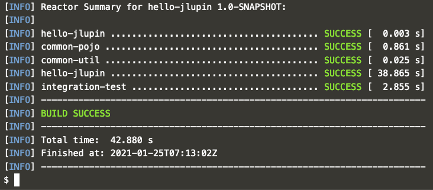

# Compiling microservice for JLupin platform

In order to simplify the process of integrating your application with jlupin platform, we created a plugin for maven that helps in packaging and deploying your services. More information about the aforementioned plugin can be found [here](https://jlupin.io/documentation/continuous-delivery-maven-plugin-161).

For now let's focus on the `package` command, that compiles all the source code and creates a so called "fat *.jar". This package will already contain all required dependencies, so the only left to do is let jlupin take care of starting the application.

The basic usage of the `package` command is like following:

`mvn package`{{execute}}

More on that command can be read [here](https://jlupin.io/documentation/continuous-delivery-maven-plugin-161/page/usage-create_fat_jar.html).

If every required file was created correctly, you should see in the terminal that the process exited with success:

