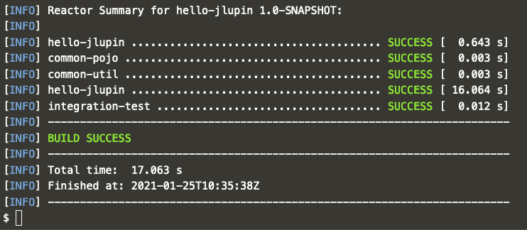

# Deploying microservice for JLupin platform

As a result from the previous step, we should have a compilable and deployable package available in our project structure. There are two possible methods of deploying your app to jlupin node.

First one, the simpler one, consists only of a single step. All you need to do, is use the previous `package` command from our maven plugin with additional parameter, which tells maven to deploy the archive to jlupin's node on localhost.

Naturally it's possible to deploy to a remote location as well, you can find more information on that [here](https://jlupin.io/documentation/continuous-delivery-maven-plugin-161/page/commands-deploy.html).

In order to deploy the app, run the command:

`mvn com.jlupin:jlupin-platform-maven-plugin:1.6.1.0:deploy`{{execute}}

After a couple of seconds, you should see a message that the operation finished successfully.

