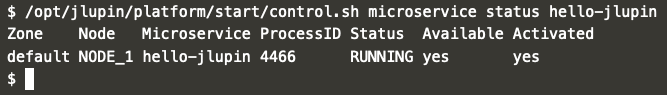

# Testing new application

Now visit the following link, to see your application in action: [hello jlupin!](https://[[HOST_SUBDOMAIN]]-8000-[[KATACODA_HOST]].environments.katacoda.com/hello-jlupin/greeting)

You can also check application's status with the control CLI:

`/opt/jlupin/platform/start/control.sh microservice status hello-jlupin`{{execute}}

You should see your app's PID and status:

