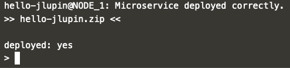

# Alternative deployment process

There's also an alternative way to deploy the application to jlupin's platform. Let's see how it differs from using maven plugin.

1. First you need to copy the created package. It should still be available in the `target` directory of the project. For simplification purposes, we'll rename the zip file while copying.

  `cp /root/scenario/project/hello-jlupin/implementation/target/hello-jlupin-1.0-SNAPSHOT.zip /opt/jlupin/platform/upload/hello-jlupin.zip`{{execute}}

2. Start up the control CLI:

  `/opt/jlupin/platform/start/control.sh`{{execute}}

3. Use `deploy` command to upload archive's content to jlupin and start the application that is there:

  `microservice deploy hello-jlupin.zip`{{execute}}

  

4. Once again, visit the following link, to see your application in action: [hello jlupin!](https://[[HOST_SUBDOMAIN]]-8000-[[KATACODA_HOST]].environments.katacoda.com/hello-jlupin/greeting)
