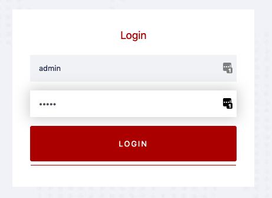
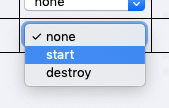
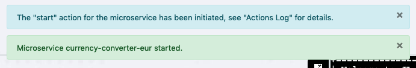

# Webcontrol panel

If the scripts in the previous step finished successfully go to the [webcontrol](https://[[HOST_SUBDOMAIN]]-8888-[[KATACODA_HOST]].environments.katacoda.com/webcontrol/) panel and see that one of the microservices is not in state `RUNNING`.

Also if you go the [exchange application](https://[[HOST_SUBDOMAIN]]-8000-[[KATACODA_HOST]].environments.katacoda.com/exchange/), you'll see, that currency conversion is not working correctly, due to the fact, that one of microservices is missing. JLupin takes care of that and prevents failure in the whole cluster, thus in the table with 
conversion results only one currency is missing, the rest are calculated correctly.

In order to start the missing application you can either use the webcontrol panel or the CLI. Instructions for both variants are described in the next steps.

## Starting the service using webcontrol

1. Open webcontrol panel in the new tab: [webcontrol](https://[[HOST_SUBDOMAIN]]-8888-[[KATACODA_HOST]].environments.katacoda.com/webcontrol/). Login using these credentials:
  - username: `admin`
  - password: `admin`

2. Open second tab "Microservice" in the table at the bottom of the page.

3. Find missing microservice and in the dropdown select action "start".

4. Wait a couple of seconds, you should see a notification that jlupin finished the command. You can test the currency conversion again and see the difference: [exchange application](https://[[HOST_SUBDOMAIN]]-8000-[[KATACODA_HOST]].environments.katacoda.com/exchange/).

## Test

Open the [exchange application](https://[[HOST_SUBDOMAIN]]-8000-[[KATACODA_HOST]].environments.katacoda.com/exchange/) once again and see that now the conversion all currencies are converted correctly.

## Stopping the microservice

Before proceeding, stop the same microservice using the aforementioned dropdown and wait for the success notifications.
