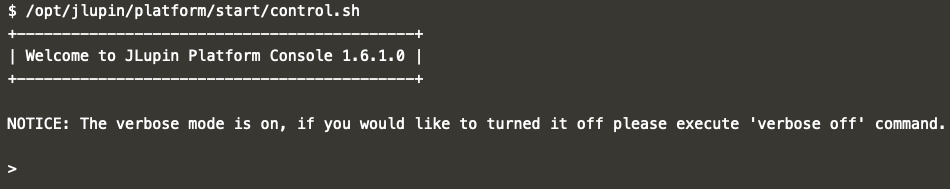
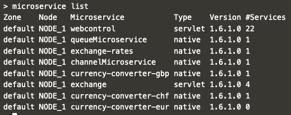
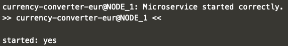
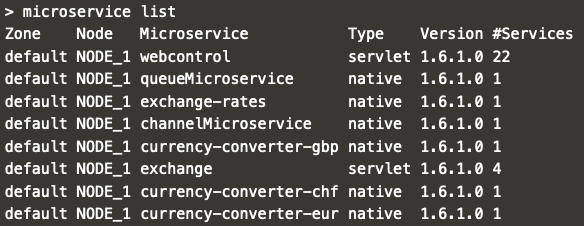

# CLI

In the previous step you learned to use the webcontrol panel to start a microservice deployed to jlupin node. Now you'll see an alternative, programmatic approach to the same task. Your task will be to follow the instructions and start the microservice using the terminal.

## Starting the service using CLI

1. Start the control CLI:
`/opt/jlupin/platform/start/control.sh`{{execute}}

2. List the microservices:
`> microservice list`

3. Notice which service is not running and start it:
`> microservice start currency-converter-eur`

4. After several seconds you'll se the confirmation in the console that the service started:

5. List all microservices again:

## Test

Open the [exchange application](https://[[HOST_SUBDOMAIN]]-8000-[[KATACODA_HOST]].environments.katacoda.com/exchange/) once again and see that now the conversion all currencies are converted correctly.