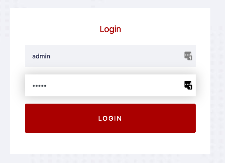
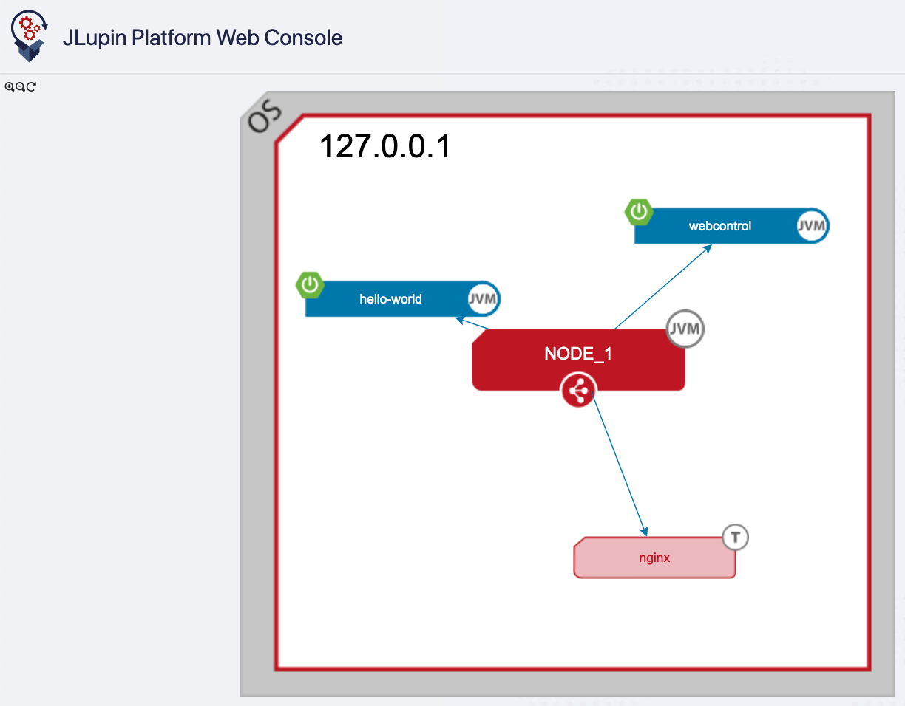
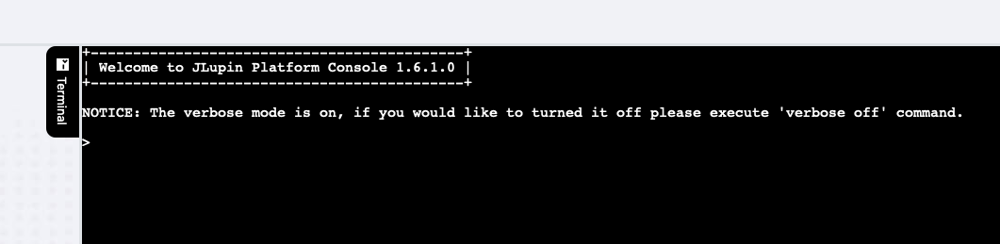
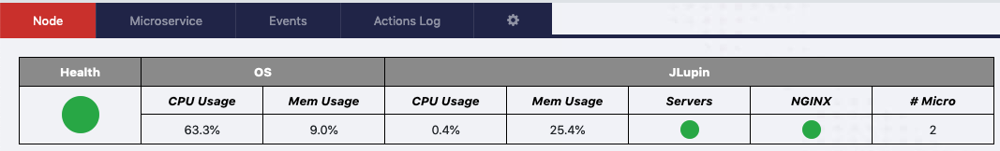

# JLuping Webcontrol panel

If the scripts in the first step finished successfully, you should be able to see the JLupin webcontrol application by opening the following link in the new browser tab:
[webcontrol](https://[[HOST_SUBDOMAIN]]-8888-[[KATACODA_HOST]].environments.katacoda.com/webcontrol/).

This application could be helpful to control the JLupin cluster. There's an overview of running application, user can also use it in order to pass commands to each of the microservices currently deployed on the platform.

By default, both username and password are: `admin`.

## Webcontrol overview

After successful login you'll see a webcontrol panel consisting of three parts: nodes overview, terminal with control CLI and table containing some more details about the cluster.

### Nodes overview

Here you can see the applications deployed and running inside the jlupin node. It is only for visualization purposes. When having more than one node in the cluster, you'll see them all here.

### Control CLI terminal

This is webcontrol's equivalent but inside a terminal - here you can pass all commands to the node for controlling the microservices, checking their status or controllin the node. The CLI's introduction will be on the next page of this tutorial.

### Cluster details

Here you can observe current resources usage of the cluster, as well as pass basic commands to the microservices that currently deployed to the cluster.
