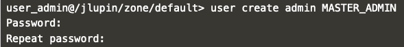
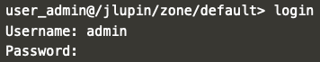

# JLupin Platform Control Center

JLupin Control Center is a tool for managing whole environment build with JLupin Platform. It allows to scale your environment, change configurations, manage nodes, microservices, applications, etc. It operates on some primary units to make managing your environment easier.

## User management

JLupin Control Center has built in user management features. To make any operation you need to log in first. Access for users is defined in two ways (both of them must be passed before access to data is granted): access to resource and access to command. It is defined per role which then is assigned to users when creating.

There are two users defined by default:
- `user_admin` with role `USER_ADMIN`
- `jmx_extractor` with role `JMX_EXTRACTOR`

Further reading on user roles and possible permissions changes are provided [here](https://jlupin.io/documentation/jlupin-platform-control-center-161/page/users-roles.html).

### Admin user creation

For the purpose of this scenario you'll need an user with complete admin privileges that are provided by the role `MASTER_ADMIN`. In order to create this user follow these steps:

1. Start up the jpcc console:

  `console`{{execute}}

2. Login to the console using `user_admin` credentials, which by default are: `user_admin/user_admin`.

3. For simplicity, let's turn off verbose mode:

  `verbose off`{{execute}}

4. Create a user with login `admin`, role `MASTER_ADMIN` and your own password. Remember it! It'll be needed later.

  `user create admin MASTER_ADMIN`{{execute}}

  

5. Relog to the `admin` user.

  `login`{{execute}}

  

On the next page, we'll continue with getting to know several commands for zone creation and management.
