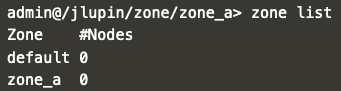
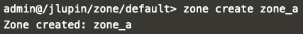
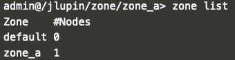

# JLupin Platform Control Center - zone management

Zone is one of the primary units in the jlupin platform. They are logical group of nodes. In most configurations all nodes in same zone have access to each other. Node can be connected only to one zone.

Further reading on zone management and possible commands are provided [here](https://jlupin.io/documentation/jlupin-platform-control-center-161/page/commands-zone.html).

## New zone creation

1. You should still be logged in to the console as the `admin` user. First list the zones that are already available in the jlupin platform.

  `zone list`{{execute}}

  

2. Create a new zone with name `zone_a`.

  `zone create zone_a`{{execute}}

  

3. List available zones once again.

  `zone list`{{execute}}

  

4. Change context inside the console to newly created zone.

  `cd ../zone_a`{{execute}}

  

On the next page, we'll continue with getting to know several commands for node management.
