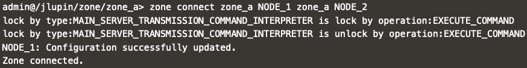

# JLupin Platform Control Center - node management

Node is one of the primary units in the jlupin platform. They are primary physical units of your environment. They are giving compute spaces for your microservices. You connect them to Control Center to let it know about your environment.

Further reading on zone management and possible commands are provided [here](https://jlupin.io/documentation/jlupin-platform-control-center-161/page/commands-node.html).

## Connecting nodes to the zone

1. You should still be logged in to the console as the `admin` user and your context should be directed at the new zone you created in the previous step: `zone_a`. First list available nodes in the current zone.

  `node status`{{execute}}

  

2. Connect `NODE_1` to `zone_a`. In order to do that you'll need the `TRANSMISSION_PORT` of the aforemention node, which in this case is `14096`.

  `node connect localhost zone_a 14096`{{execute}}

  

3. Connect `NODE_2` to `zone_a`. In order to do that you'll need the `TRANSMISSION_PORT` of the aforemention node, which in this case is `19096`.

  `node connect localhost zone_a 19096`{{execute}}

  

4. Check the nodes status again and notice the difference.

  `node status`{{execute}}

  

## Enabling communication between nodes

As you can probably recall from the previous scenario, you already learned how to enable communication in both directions between `NODE_1` and `NODE_2`. You'll achieve the same result but this time using `JPCC` instead of the `control CLI`.

But before we start connecting the nodes, you can confirm on your own that there's exchange application working on each node, with one microservice missing: [exchange app - deployed on NODE_1](https://[[HOST_SUBDOMAIN]]-8000-[[KATACODA_HOST]].environments.katacoda.com/exchange/) or [exchange app - deployed on NODE_2](https://[[HOST_SUBDOMAIN]]-18000-[[KATACODA_HOST]].environments.katacoda.com/exchange/).

1. You should still be logged in to the console as the `admin` user and your context should be directed at the new zone you created in the previous step: `zone_a`. First list peers of all the nodes that are connected to the zone `zone_a`.

  `node peers`{{execute}}

  

2. Connect `NODE_1` to `NODE_2`.

  `zone connect zone_a NODE_1 zone_a NODE_2`{{execute}}

  

3. Check the list of peers and notice what changed.

  `node peers`{{execute}}

  

4. Connect `NODE_2` to `NODE_1`.

  `zone connect zone_a NODE_2 zone_a NODE_1`{{execute}}

  

5. Check the list of peers and notice what changed.

  `node peers`{{execute}}

  

Now check the exchange app on both nodes again, you should see complete result of the currency conversion.
