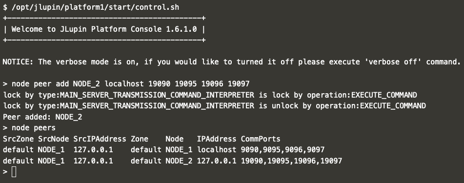
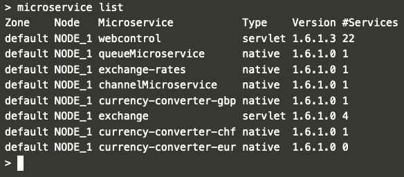

# Communication between nodes

In JLupin the communication between peers is one directional. It means that in order to let NODE_1 and NODE_2 communicate with each other, you'll have to do it in two separate steps: first adding NODE_2 as NODE_1's peer and then vice versa.

## NODE_1 -> NODE_2

Now let's focus on adding NODE_2 as NODE_1's peer. You can do it using the CLI.

Start the CLI:
`/opt/jlupin/platform1/start/control.sh`{{execute}}

Enter the command:
`node peer add NODE_2 localhost 19090 19095 19096 19097`{{execute}}

See the peers of NODE_1:
`node peers`{{execute}}

Expected result:

Quit the CLI:
`quit`{{execute}}

If everything went smoothly, you should be able to start the [exchange](https://[[HOST_SUBDOMAIN]]-8000-[[KATACODA_HOST]].environments.katacoda.com/exchange/) application on NODE_1 and get all the currency conversion results in the table:

Notice that we still don't have the required microservice started on NODE_1, jlupin uses internal communication and finds required microservice in the other node. If you want to check that the missing microservice is still not running on NODE_1, you can do the following:

Start the CLI:
`/opt/jlupin/platform1/start/control.sh`{{execute}}

Enter the command:
`microservice list`{{execute}}

Expected result:

Quit the CLI:
`quit`{{execute}}
