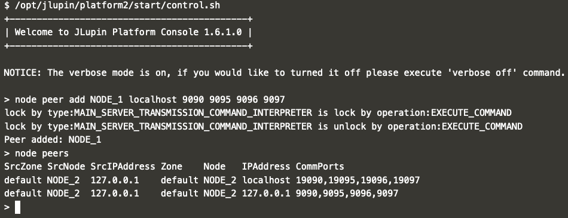

# Communication between nodes

In JLupin the communication between peers is one directional. It means that in order to let NODE_1 and NODE_2 communicate with each other, you'll have to do it in two separate steps: first adding NODE_2 as NODE_1's peer and then vice versa.

## NODE_1 -> NODE_2

Now let's focus on adding NODE_1 as NODE_2's peer. You can do it using the CLI.

Start the CLI:
`/opt/jlupin/platform1/start/control.sh`{{execute}}

Enter the command:
`node peer add NODE_1 localhost 9090 9095 9096 9097`{{execute}}

See the peers of NODE_2:
`node peers`{{execute}}

Expected result:

If everything went smoothly, you should be able to start the [exchange](https://[[HOST_SUBDOMAIN]]-18000-[[KATACODA_HOST]].environments.katacoda.com/exchange/) application on NODE_2 and get all the currency conversion results in the table:

